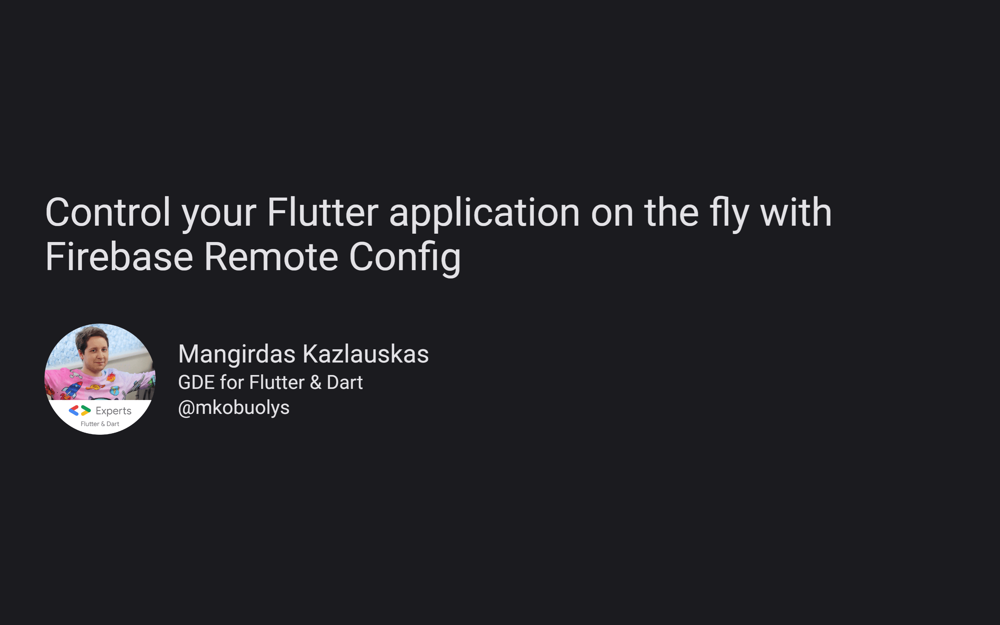

# Control your Flutter application on the fly with Firebase Remote Config



A presentation from [Fluttercon 2023](https://fluttercon.dev/).

Powered by [flutter_deck](https://pub.dev/packages/flutter_deck) 🚀

---

## Building

You can follow these instructions to build the app and install it onto your device.

### Prerequisites

If you are new to Flutter, please first follow the [Flutter Setup](https://flutter.dev/setup/) guide.

### Building and installing the Flutter Design Patterns app

```
git clone git@github.com:mkobuolys/firebase-remote-config-talk.git
cd firebase-remote-config-talk
flutter pub get
flutter run
```

The `flutter run` command both builds and runs the Flutter app on your device, browser or emulator.
